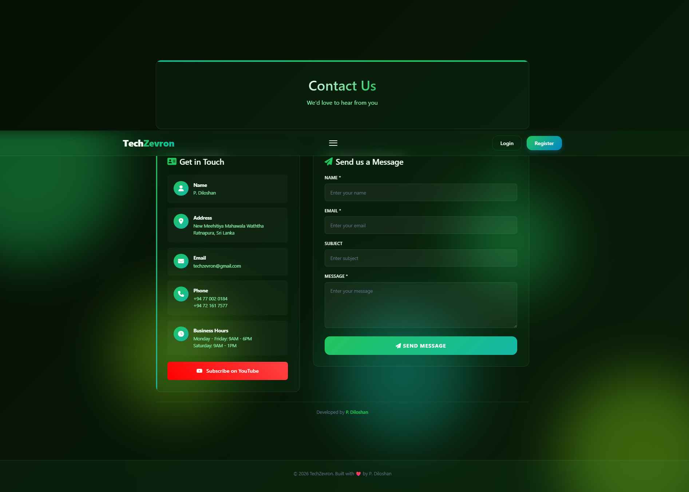

# TechZevron - Modern Tech & AI Platform 🤖🚀

TechZevron is an innovative web application built to showcase modern technology solutions, artificial intelligence integrations, enterprise services, and digital transformation tools.

---

## 📸 Preview & Screenshots



### 🎥 Demo Video / Preview
<!-- Option 1: If your recording is converted to a .gif file -->


<!-- Option 2: If it is a video file or hosted on YouTube, use this line instead -->
<!-- [](YOUR_VIDEO_URL_HERE) -->

---

## 🌟 Key Features

- **Modern & Interactive UI:** Sleek user interface featuring dynamic animations and responsive design elements.
- **Services & Solutions Hub:** Comprehensive overview of tech consultancy, AI development, and software solutions.
- **Blog & Tech Insights:** Integrated blog section to publish articles, tech news, and tutorials.
- **Contact & Client Portal:** Functional inquiry form system for clients to get in touch for custom projects.

## 🛠️ Tech Stack

- **Frontend:** HTML5, CSS3, JavaScript (ES6+)
- **Backend:** PHP
- **Database:** MySQL
- **Version Control:** Git & GitHub

## ⚙️ Installation & Setup

1. **Clone the Repository:**
   ```bash
   git clone [https://github.com/diloshan-dev/techzevron-web.git](https://github.com/diloshan-dev/techzevron-web.git)
